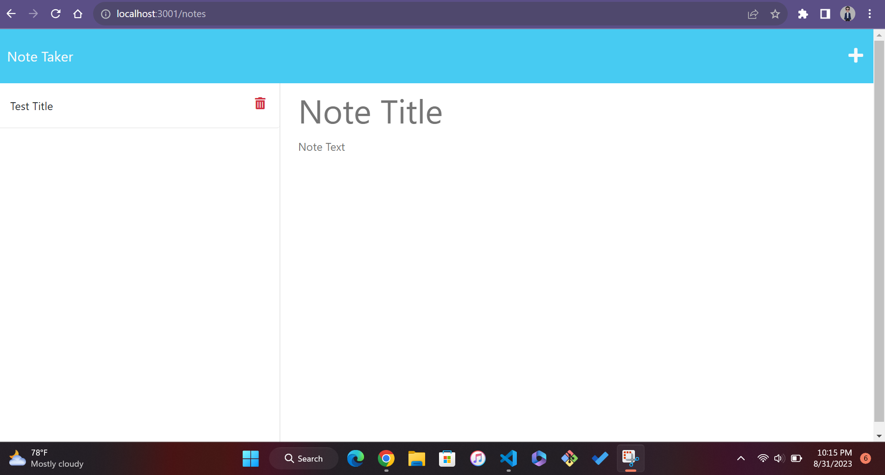
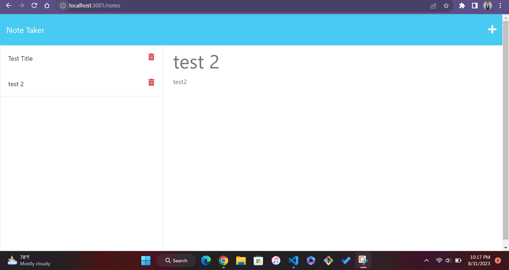
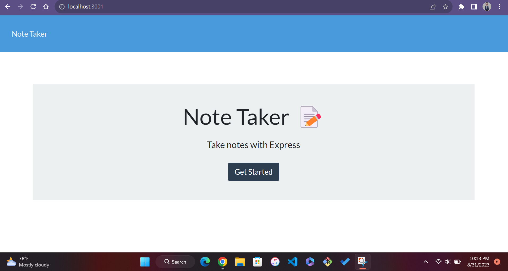

# JEG-NoteTaker
 
   

  ## Description
  
  With this note taking app you will be able to organize your thoughts and keep track of tasks you need to complete with ease.
  
  ## Table of Contents
  - [Installation](#installation)
  - [Usage](#usage)
  - [Contribution](#contribution)
  - [Sample](#sample)
  - [License](#license)
  - [Questions](#questions)
  
  ## Installation
  <ul>
<li>1.git clone the code</li>
<li>2.install express and uniquit in order to run the aplication</li>
<li>3.run the terminal and type server.js, the aplication will be ready to use on por 3001</li>
</ul>

  ## Usage
  
  Open the note taker and you will be presented with a link to a notes page in which you will be able to select existing notes listed in the left-handed column or create new notes by typing in the rigth-hand column, once you are done click the save icon and you will be all set.

  ## Contribution
  for this project N/A
  
  ## sample

  

  ## License
  
   THE SOFTWARE IS PROVIDED “AS IS”, WITHOUT WARRANTY OF ANY KIND, EXPRESS OR IMPLIED, INCLUDING BUT NOT LIMITED TO THE WARRANTIES OF MERCHANTABILITY, FITNESS FOR A PARTICULAR PURPOSE AND NONINFRINGEMENT. IN NO EVENT SHALL THE AUTHORS OR COPYRIGHT HOLDERS BE LIABLE FOR ANY CLAIM, DAMAGES OR OTHER LIABILITY, WHETHER IN AN ACTION OF CONTRACT, TORT OR OTHERWISE, ARISING FROM, OUT OF OR IN CONNECTION WITH THE SOFTWARE OR THE USE OR OTHER DEALINGS IN THE SOFTWARE.

  ## Questions
  <ul>
      <li> <a href="https://github.com/jgalvez98>Github Profile"> Github profile </a>  </li>
      <li> <a href="mailto:jgalvez98@gmail.com"> Email Me </a>  </li>
  </ul>
